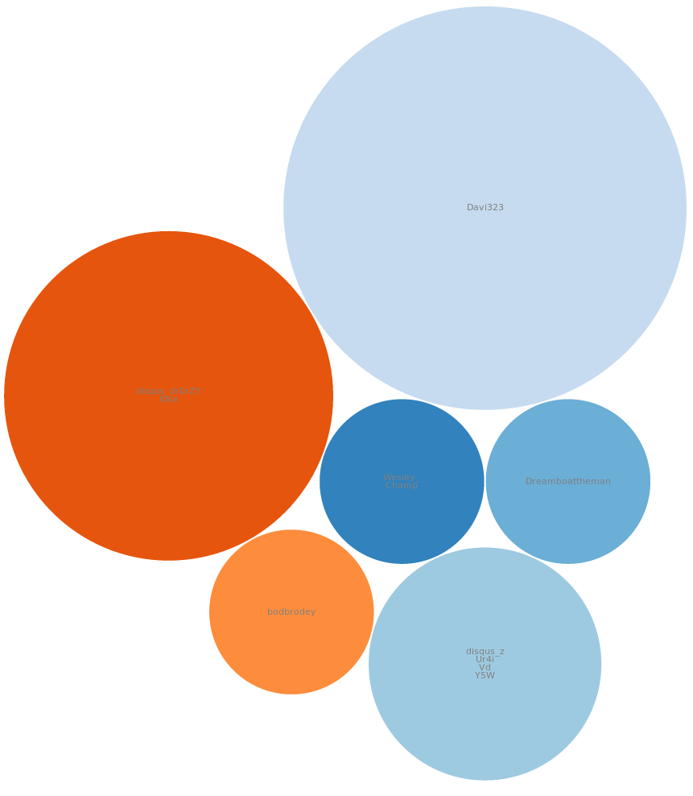
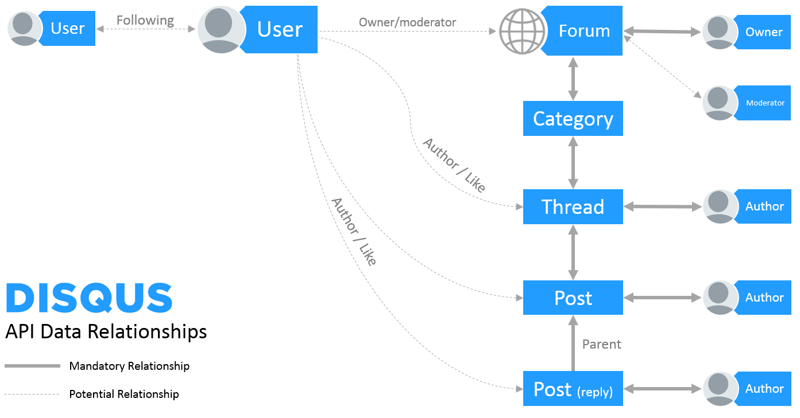

# drisqus - a high level client of Disqus' API, written in Go

[](https://opensource.org/licenses/Apache-2.0)
[](http://godoc.org/github.com/pierods/drisqus)
[](https://goreportcard.com/report/github.com/pierods/drisqus)
[](https://travis-ci.org/pierods/drisqus)

Drisqus is a high level client of Disqus' API ((https://disqus.com/api/docs/)). Its underlying library is Gisqus (https://github.com/pierods/gisqus).
Drisqus aims to cover endpoints that read data (GET method) for reporting, statistical and data drilling purposes.

As in Gisqus, Drisqus has the following limitations:
* it only supports authentication in the form of "Authenticating as the Account Owner" (https://disqus.com/api/docs/auth/)
* endpoints that require entity IDs (thread ID, forum ID etc) but where they can be provided implicitly by authentication have their wrappers 
  requiring those parameters explicitly in the method signature

The "related" parameter in many Disqus endpoints is not supported, since data returned through it can always be gotten with a direct call to the 
respective api. In this sense, Drisqus covers the complete hierarchy of Disqus' object model.

### Usage
After having obtained an API key from Disqus (you must create an app for that on Disqus' control panel), one must obtain an instance of Gisqus and
then pass it to Drisqus:

```Go
    import  "context"
    import  "net/url"
    import  "github.com/pierods/gisqus"
    import  "github.com/pierods/drisqus"
    ...
    g := NewGisqus("api key")
    d := NewDrisqus(g)
    ctx, cancel := context.WithCancel(context.TODO())
```

One can then proceed to make calls against Disqus' endpoints. Calls do not support timeouts, but they are cancellable (https://golang.org/pkg/context/).

```Go
    
    forums, err := d.ForumInteresting(ctx)
    if err != nil {
        ...
    }
    fmt.Println(forums[0].forum.Name)
```
Methods that support the "pages" parameter will retrieve pages of size 100 (or less when 100 is not supported by Disqus). If pages is set to -1, all pages are retrieved.

### Data drilling and statistics
Drisqus makes it really is to drill down in Disqus' API and calculate statistics.

As an example, let's pick the latest thread from a forum and check out which comment authors don't have any replies to their posts.

```Go
    import "fmt"
    import  "context"
    import  "net/url"
    import  "github.com/pierods/gisqus"
    import  "github.com/pierods/drisqus"
    ...
    g := NewGisqus("api key")
    d := NewDrisqus(g)
    
    ctx, cancel := context.WithCancel(context.TODO())
    forums, err := d.ForumInteresting(ctx, 1)
    if err != nil {
        ...
    }
    forumID := forums[0].Forum.ID
    threads, err := d.ForumThreadsQuick(ctx, forumID, 1)
    if err != nil {
        ...
    }
    threadID := threads[0].ID
    posts := d.ThreadPostsQuick(ctx, threadID, -1)
    postsByParent := make(map[string]*gisqus.Post)
  
    for _, post := range posts {
        postsByParent[post.parent] = post    
    }
    
    postsWithoutReplies := []*gisqus.Post
    for _, post := range posts {
        if _, exists := postsByParent[post.ID]; !exists {
            postsWithoutReplies = append(postsWithoutReplies, post)  
        }
    }
    
    authorsWithoutRepliesMap := make(map[string]bool) 
    for _, post := range postsWithoutReplies {
        authorsWithoutRepliesMap[post.Author.ID] = true
    }
    authorsWithoutReplies := []string
    
    for authorID, _ := range authorsWithoutRepliesMap {
        authorsWithoutReplies = append(authorsWithoutReplies, authorID)
    }
```

#### d3.js support
Drisqus includes a handful of methods for [d3.js](https://d3js.org/) support in the file drisqus_d3js.go. They make various kinds of aggregate data into
slices, for use by many d3.js diagrams.


An example of diagrams with data created by MakePostCountSlice :



### Notes
All calls are cancellable, so they won't catastrophically block on a call chain.

The complete Disqus hierarchy is modeled:




except for Categories, since the vast majority of forums use only one category for all posts.

### Endpoints covered
https://disqus.com/api/docs/
##### Forums
* details
* interestingForums
* listCategories
* listFollowers 
* listMostActiveUsers
* listMostLikedUsers
* listThreads
* listUsers

##### Threads
* details
* list
* listHot 
* listPopular 
* listPosts
* listUsersVotedThread
* set

##### Posts
* details
* getContext 
* list
* listPopular

##### Users
* details 
* interestingUsers
* listActiveForums
* listActivity 
* listFollowers 
* listFollowing 
* listFollowingForums 
* listMostActiveForums 
* listPosts
